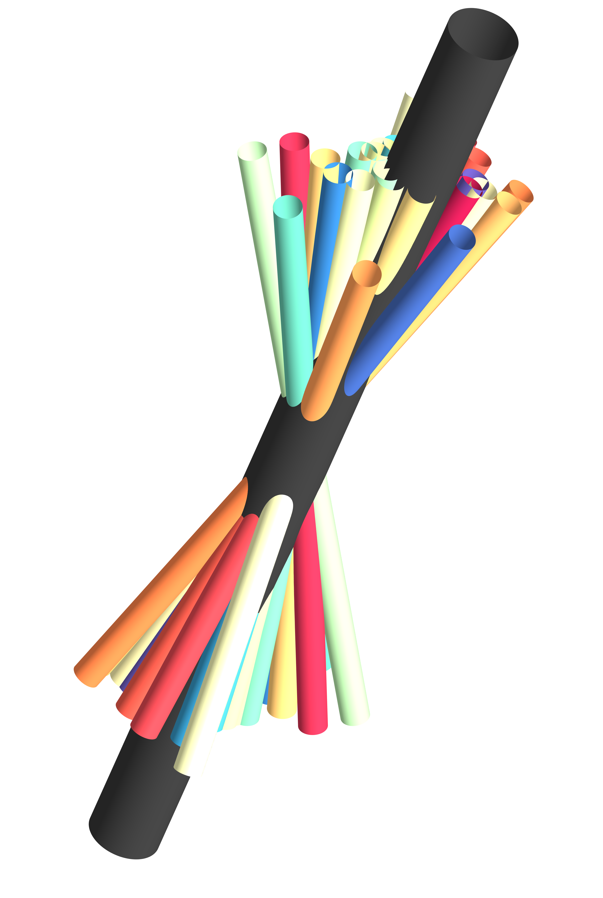

## MUSHAR: A MATLAB toolbox for three-dimensional reconstruction and analysis of muscle shape and architecture.

    
## Features
1. Establish point-to-point correspondence on surface and inside volumes through non-rigid registration of distance maps.
1. Reconstruction of group-averaged muscle shape and muscle fibre orientations from magnetic resonance imaging and diffusion tensor imaging data.
    1. Includes code for averaging and interpolating diffusion tensors in the [log-Euclidean domain](https://doi.org/10.1002/mrm.20965)
1. Statistical analysis of local changes in shape and architecture (pennation angles).
1. Visualization of changes in shape and fibre orientations.

## Installation
The following software tools should be installed and made available on the command line:
* Matlab (developed and tested in version R2019b)
* [Shapeworks](http://sciinstitute.github.io/ShapeWorks/) (developed and tested on version 6.0.0-RC9)
* [Elastix](https://elastix.lumc.nl/) (developed and tested on version 4.7)

