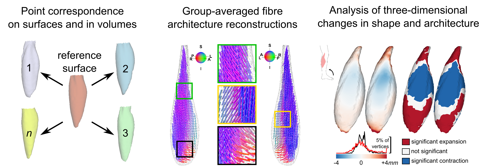

## *MUSHAR*:
A MATLAB toolbox for three-dimensional reconstruction and analysis of *MU*scle *SH*ape and *AR*chitecture.

    
    
## Features
1. Establish point-to-point correspondence on surfaces and inside volumes through non-rigid registration of distance maps.
1. Reconstruction of group-averaged muscle shape and muscle fibre orientations from magnetic resonance imaging and diffusion tensor imaging data.
    1. Includes code for averaging and interpolating diffusion tensors in the [log-Euclidean domain](https://doi.org/10.1002/mrm.20965)
1. Statistical analysis of local changes in shape and fibre orientations.
1. Visualization of changes in shape and fibre orientations.

## Installation
* Install Matlab (developed and tested in version R2019b)
* Add the MUSHAR-toolbox to the Matlab path.

The following software tools should be installed and made available on the command line:
* [Shapeworks](http://sciinstitute.github.io/ShapeWorks/) (developed and tested in version 6.0.0-RC9)
* [Elastix](https://elastix.lumc.nl/) (developed and tested in version 4.7)

## Getting started
* Run the demo scripts to  guide you through the main steps.
* Modify the scripts to set up your own analysis.

## Paper
Read the accompanying paper on [bioRxiv](https://doi.org/10.1101/2021.09.08.459536) (or see preprint.pdf).

